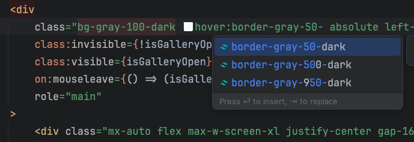

# tailwindcss-instant-dark-mode

A tailwindcss plugin that make a class to instant apply both light and dark variants of a color automatically.

## Features

Adding new color class to tailwindcss, topup from original class with `-dark` prefix that will automatically apply both light and dark variants of a color.

| Original tailwindcss variant | Instant dark mode |
|----------|------------------------|
| `bg-blue-100 dark:bg-blue-900` | `bg-blue-100-dark` |
| `text-kmutt-800 dark:text-kmutt-200` | `text-kmutt-800-dark` |
| `hover:border-blue-300 dark:hover:border-blue-700` | `hover:border-blue-300-dark` |

#### Supported colors properties
- backgroundColor / `bg-`
- borderColor / `border-`
- color / `text-`
- ringColor / `ring-`
- divideColor / `divide-`
- placeholderColor / `placeholder-`

#### Additional features
- Support for custom color classes
- Works with `hover:` and other variants
- Support tailwindcss language server for auto-completion


#### Limitations
- Only works with colors that defined in number format (e.g. `bg-blue-500`), not with color name (e.g. `bg-blue`)
- Only map directly between 2 color pair, with more customizations, may need to fallback to original tailwindcss syntax.

## Installation

```bash
npm install @bsthun/tailwindcss-instant-dark-mode
```

## Usage

```js
// tailwind.config.js
import { tailwindcssInstantDarkMode } from '@bsthun/tailwindcss-instant-dark-mode';

const config: Config = {
	darkMode: ['class'],
	plugins: [tailwindcssInstantDarkMode()],
};

export default config;
```
